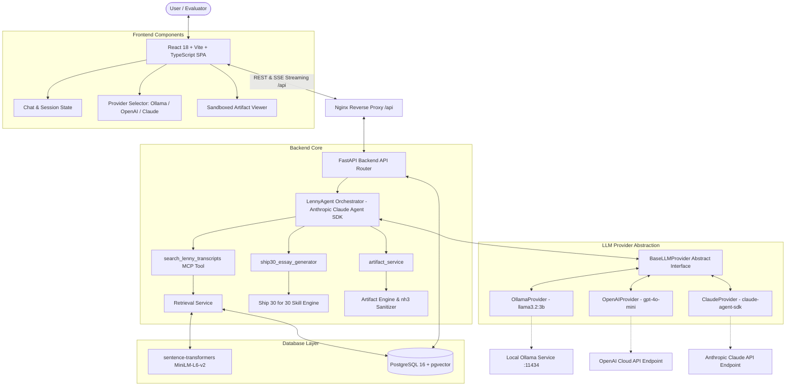
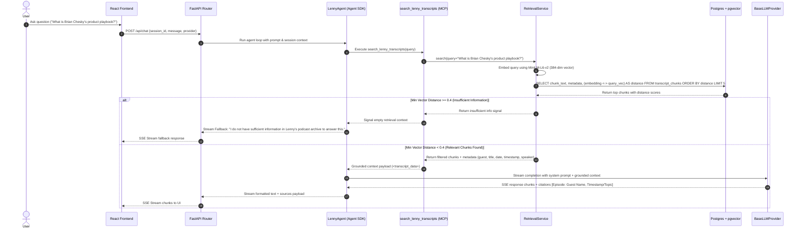
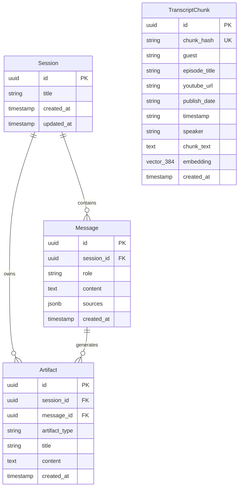

# Architecture Documentation

## Project: The Lenny Growth Assistant
**Version**: 1.2.0  
**Author**: Lead Forward Deployed Engineer  
**Status**: Approved & Complete (Phases 0–10A)

---

## 1. Architecture Overview

**The Lenny Growth Assistant** is built following a decoupled, layered system architecture. The frontend is a React 18 + Vite Single Page Application (SPA) styled with Tailwind CSS, while the backend is an asynchronous Python FastAPI application powering an agent orchestrator (`LennyAgent`) built on the **Anthropic Claude Agent SDK (`claude-agent-sdk==0.2.152`)**.



---

## 2. Component Responsibilities

| Component | Layer | Primary Responsibility |
| :--- | :--- | :--- |
| **React + Vite SPA** | Frontend | Renders the dual-pane workspace, manages active session state, consumes SSE streaming API endpoints (`/api/chat`), formats markdown content, and hosts the sandboxed `<iframe>` artifact viewer. |
| **Nginx Reverse Proxy** | Frontend Container | Proxies `/api/` requests to `http://backend:8000/api/` with `proxy_buffering off;` for SSE streaming in Docker. |
| **FastAPI Router** | Backend API | Exposes REST endpoints (`/api/sessions`, `/api/health`, `/api/artifacts`, `/api/essays/ship30`) and SSE streaming (`/api/chat`), manages CORS, handles request validation. |
| **LennyAgent** | Agent Orchestrator | Anthropic Claude Agent SDK orchestrator that receives conversation state, plans execution, invokes MCP tools (`search_lenny_transcripts`), and enforces grounded responses. |
| **RetrievalService** | RAG / Service | Generates embeddings for user queries using `sentence-transformers/all-MiniLM-L6-v2`, queries PostgreSQL pgvector using cosine distance (`<->`), applies similarity threshold filtering ($\text{distance} < 0.4$), and formats citation metadata. |
| **Ship30EssayGenerator** | Skill Module | Formats structured ~1,250-word essays from grounded retrieval context, applying specific narrative hooks, short paragraphs, bold emphasis, and actionable checklists. |
| **ArtifactService & Sanitizer** | Artifact Module | Sanitizes generated HTML using Rust Ammonia (`nh3`), persists artifacts to PostgreSQL, and formats payloads for frontend iframe rendering. |
| **BaseLLMProvider** | LLM Abstraction | Abstract base class defining async streaming generator interfaces (`generate_stream`) and provider health check contracts. |
| **OllamaProvider** | LLM Implementation | Connects to local Ollama instance (`llama3.2:3b`), handles stream parsing, execution timeouts, and provides health status. |
| **OpenAIProvider** | LLM Implementation | Connects to OpenAI API (`gpt-4o-mini`), handles API key authentication, streaming response parsing, and error recovery. |
| **ClaudeProvider** | LLM Implementation | Connects to Anthropic API via `claude-agent-sdk==0.2.152`. |
| **PostgreSQL + pgvector** | Database | Stores sessions, chat messages, sources, artifacts, and transcript chunk vectors (8,637 chunks) with HNSW index. |
| **Ingestion Pipeline** | Data Pipeline | Download script (`scripts/ingest.py`) that fetches `ChatPRD/lennys-podcast-transcripts`, parses YAML frontmatter, chunks dialogue (500–800 tokens, 100 overlap), computes embeddings, and seeds pgvector. |

---

## 3. RAG Retrieval & Grounding Pipeline



---

## 4. Claude Agent SDK Path (Phase 6 Architecture)

The Phase 6 agent integration uses the official **Anthropic Claude Agent SDK**:

```text
User Query
  ↓
LennyAgent.run() (backend/app/agents/lenny_agent.py)
  ↓
ClaudeSDKClient & ClaudeAgentOptions
  ↓
In-Process MCP Server (create_retrieval_mcp_server)
  ↓
@tool(name="search_lenny_transcripts")
  ↓
RetrievalService.search()
  ↓
PostgreSQL pgvector (HNSW Index, distance < 0.4)
  ↓
Grounded Transcript Evidence
  ↓
Claude Agent Response & Citations
```

---

## 5. Database Schema & Data Model



---

## 6. Security & Sandboxed Iframe Architecture

1. **Backend HTML Sanitization**: All HTML artifacts pass through `ArtifactSanitizer` wrapping `nh3` (Rust Ammonia Python bindings) before persistence. Dangerous tags (`<script>`, `<iframe>`, `object`), inline event attributes (`onerror`, `onclick`), and `javascript:` URIs are stripped.
2. **Frontend Iframe Isolation**: HTML artifacts render in an `<iframe>` with strict sandbox flags:
   ```html
   <iframe sandbox="allow-scripts" srcdoc="..." title="Artifact Preview" />
   ```
3. **Security Directives Omitted**:
   - `allow-same-origin`: **Omitted** to assign a unique opaque origin, blocking access to parent DOM, `document.cookie`, `localStorage`, or session tokens.
   - `allow-top-navigation`: **Omitted** to prevent untrusted scripts from navigating the parent browser window.
4. **Prompt Injection Defense**: Retrieved transcript content is placed inside `<transcript_data>` XML tags and treated as unprivileged source data.

---

## 7. Verification & Automated Test Status

```text
Backend Unit Test Suite: 44 / 44 PASSED
Frontend Vitest Suite:    17 / 17 PASSED
Total Automated Tests:   61 / 61 PASSED (100% Pass Rate)
Frontend Build:          PASS (npm run build)
```
