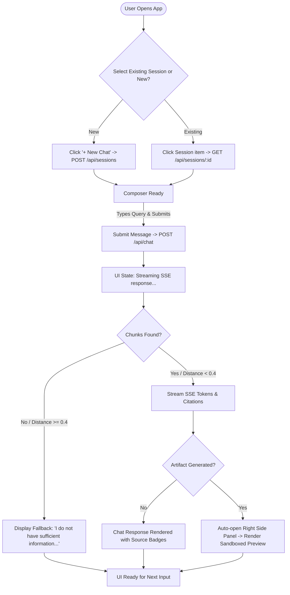

# Design Specification Document

## Project: The Lenny Growth Assistant
**Version**: 1.2.0  
**Author**: Lead Forward Deployed Engineer  
**Status**: Approved & Complete (Phases 0–10A)

---

## 1. Design Principles

1. **Grounded Transparency**: Source citations and retrieval status are prominently displayed so users can immediately verify quotes against real podcast episodes.
2. **Focus & Cognitive Ergonomics**: Clean two-column split screen allowing simultaneous conversation and artifact inspection without modal popups or tab swapping.
3. **Defense-in-Depth Visual Trust**: Clear indicators showing provider selection (Ollama vs OpenAI vs Claude), active model health, and sandboxed security status for generated HTML visual artifacts.
4. **Professional Developer Tool Aesthetics**: Clean typography, crisp slate/neutral tones, subtle borders, high contrast ratios, and purposeful UI states suitable for an executive demo.

---

## 2. Interface Layout & Information Architecture

The application features a responsive split-panel workspace:

```text
+---------------------------------------------------------------------------------------------------------+
|                                    APPLICATION HEADER (Logo, Health Status, Provider Selector)          |
+------------------------------------+--------------------------------------------------------------------+
|  LEFT PANEL: Chat & Search         |  RIGHT PANEL: Side-Panel Artifact Viewer (Collapsible)             |
|                                    |                                                                    |
|  [+ New Chat]                      |  [ Artifact Title: PLG Growth Loop ]    [Rendered|Code]  [Close X] |
|  --------------------------------  +--------------------------------------------------------------------+
|  Recent Sessions:                  |                                                                    |
|  - Brian Chesky PM Playbook        |  +--------------------------------------------------------------+ |
|  - PLG Loop Essay                  |  |                                                              | |
|                                    |  |   SANDBOXED IFRAME (sandbox="allow-scripts")                | |
|  --------------------------------  |  |                                                              | |
|  Chat Messages Stream:             |  |   [Interactive Canvas Diagram / Formatted Markdown]         | |
|  [User]: How did Airbnb grow?      |  |                                                              | |
|  [Assistant]: Brian Chesky...      |  +--------------------------------------------------------------+ |
|  Sources: [Episode: Brian Chesky]  |                                                                    |
|                                    |                                                                    |
|  --------------------------------  |                                                                    |
|  [Composer: Ask a question...]     |  [Action Buttons: Copy Code]                                       |
+------------------------------------+--------------------------------------------------------------------+
```

---

## 3. Main User Flow



---

## 4. Component Tree

```text
App
├── AppShell
│   ├── Header
│   │   ├── BrandLogo ("Lenny Growth Assistant")
│   │   ├── HealthBadge (Database & Ollama Status Indicator)
│   │   ├── ProviderSelector (Dropdown: Ollama / OpenAI / Claude)
│   │   └── Ship30Button ("Ship30 Generator")
│   │
│   └── MainWorkspace (Flex Container / Dual Pane)
│       ├── Sidebar (Session Drawer)
│       │   ├── NewSessionButton
│       │   └── SessionList (List of past chat sessions)
│       │
│       ├── ChatPanel (Left Column - ~50% Width)
│       │   ├── MessageList
│       │   │   ├── MessageItem (User / Assistant roles)
│       │   │   │   ├── MarkdownContent (react-markdown + remark-gfm)
│       │   │   │   ├── CitationBadges (Clickable episode/timestamp badges)
│       │   │   │   └── ArtifactTriggerButton ("View Generated Artifact ->")
│       │   │   └── StreamingPulse ("Streaming response...")
│       │   └── MessageComposer
│       │       ├── QuickPromptChips ("Brian Chesky Playbook", "Ship30 Essay", "PLG Metrics")
│       │       ├── TextareaInput
        │       └── SendButton
│       │
│       ├── ArtifactPanel (Right Column - ~50% Width / Collapsible)
│       │   ├── ArtifactHeader
│       │   │   ├── ArtifactTitle
│       │   │   ├── ViewModeToggle (Rendered vs Code Source)
│       │   │   └── CloseButton
│       │   ├── ArtifactMarkdownViewer (Formatted document view)
│       │   ├── ArtifactHtmlViewer (Sandboxed <iframe> container)
│       │   └── ArtifactFooter (Copy Raw Code Action)
│       │
│       └── CitationDrawer (Side Drawer)
│           ├── Source Metadata (Episode, Guest, Timestamp, Speaker, Distance)
│           └── External Link (Verified source URL)
```

---

## 5. Artifact Security Specification

- **Visual Indicator**: Visual badge displayed in artifact header: `🔒 Sandboxed (allow-scripts)`.
- **HTML Artifact Rendering**:
  ```html
  <iframe
    srcdoc="..."
    sandbox="allow-scripts"
    title="Artifact Preview"
    class="w-full h-full border-0 rounded-lg bg-white"
  />
  ```
- **Intentionally Omitted Directives**:
  - `allow-same-origin`: **Omitted** to assign an opaque origin, blocking iframe access to parent `document.cookie`, `localStorage`, or session tokens.
  - `allow-top-navigation`: **Omitted** to prevent untrusted scripts from navigating the parent application window.
